# Computer-Graphics-Labs
## Лабораторная 1

Построение графика функции.

Задаются: диапазон значений, функция, необходимо построить график с возможностью масштабирования при изменении размера окна вывода – в максимальных и минимальных точках график приближается к  верхней и нижней границам графического окна. Обязательный тест – sin(x) и x^2.
Необходимо предусмотреть выбор функций из некоторого списка. В функцию построения графика функцию передавать как параметр.
Не использовать стандартные функции построения графиков.
Язык программирования - любой (python).

  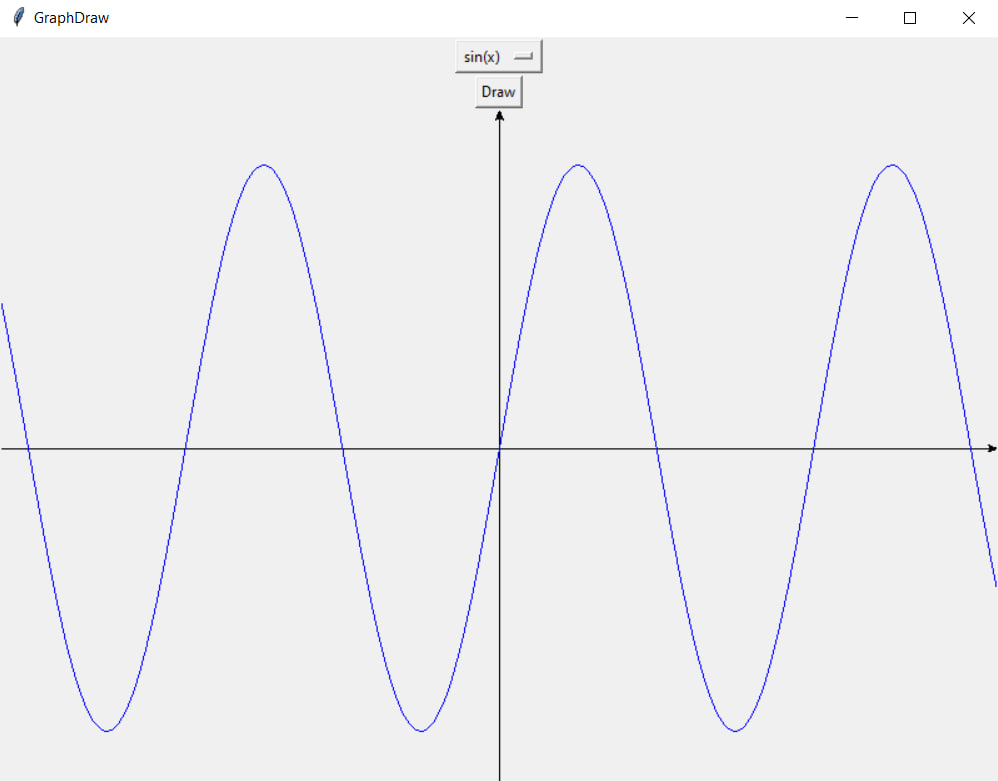

## Лабораторная 2

Цветовые пространства. Преобразование цветовых пространств.

  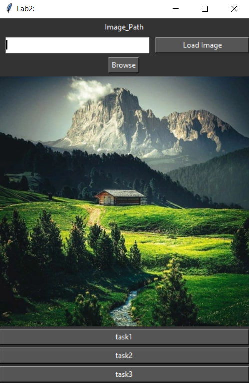

1) Преобразовать изображение из RGB в оттенки серого. Реализовать два варианта формулы с учетом разных вкладов R, G и B в интенсивность (см презентацию). Затем найти разность полученных полутоновых изображений. Построить гистограммы интенсивности после одного и второго преобразования.

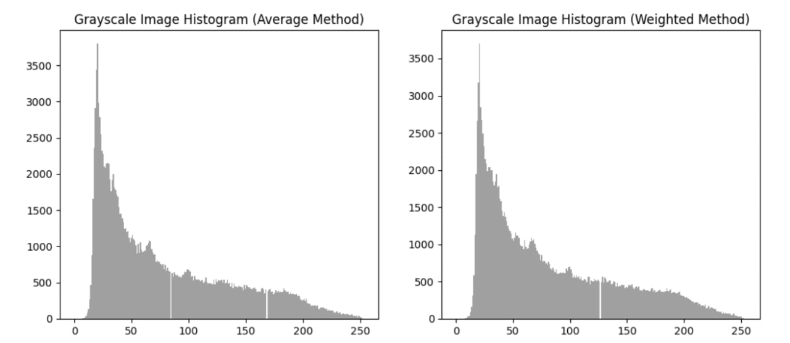

2) Выделить из полноцветного изображения каждый из каналов R, G, B  и вывести результат. Построить гистограмму по цветам (3 штуки).

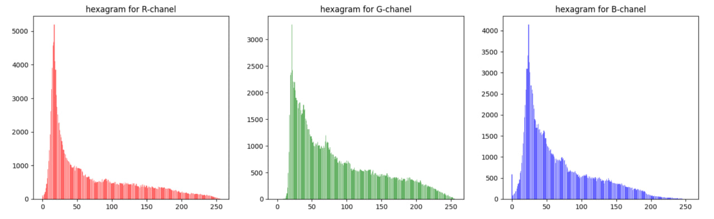

3) Преобразовать изображение из RGB в HSV. Добавить возможность изменять значения оттенка, насыщенности и яркости. Результат сохранять в файл, предварительно преобразовав обратно.

  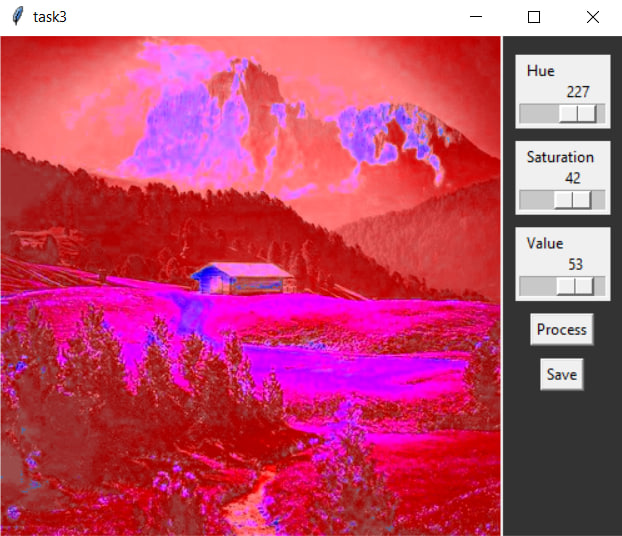

## Лабораторная 3
Растровые алгоритмы

Задание 1. Заливка и выделение границы.

- 1а. Рекурсивный алгоритм заливки на основе серий пикселов (линий)  заданным цветом.

  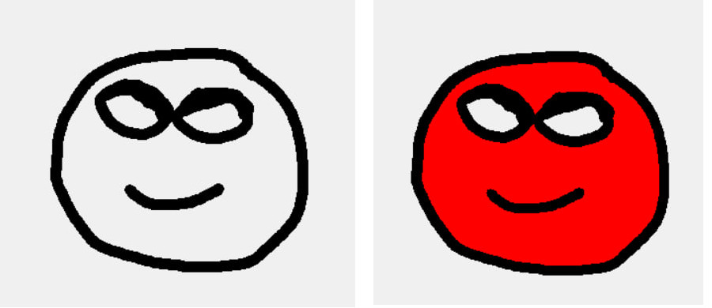

- 1б. Рекурсивный алгоритм заливки на основе серий пикселов (линий)  рисунком из графического файла. Рассмотреть случаи когда файл небольшого размера и заливается циклически и когда большой. Область произвольной формы.

  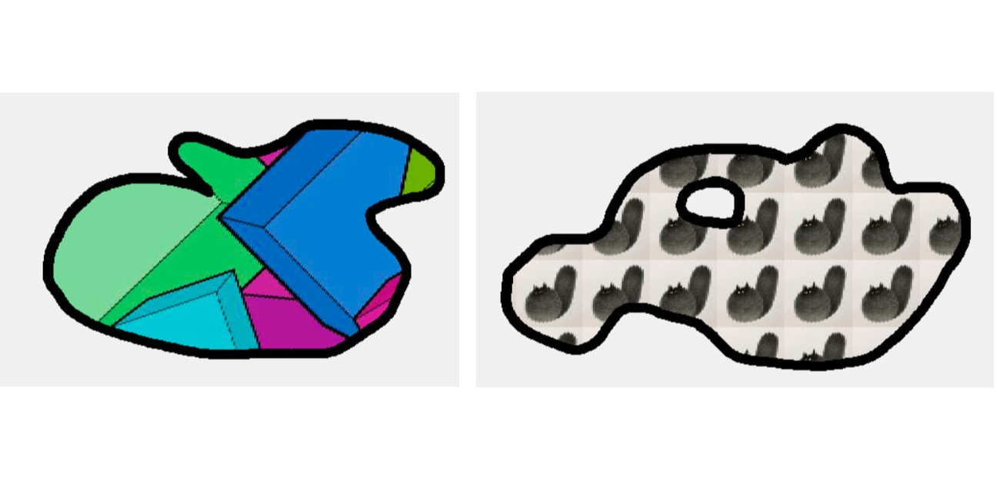

- 1в. Выделение границы связной области. На вход подается изображение. Граница связной области задается одним цветом. Имея начальную точку границы организовать ее обход, занося точки в список в порядке обхода. Для контроля полученную границу прорисовать поверх исходного изображения.

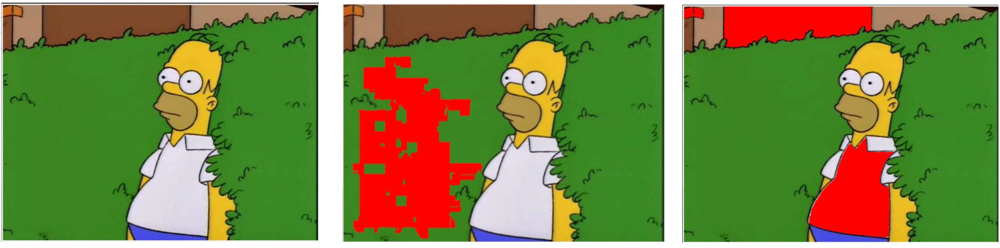

! Третье изображение - немного добавил своего - цвет проходит не только, когда равен выбранному, но и когда декартово расстояние между цветами не больше определённого значения. !

Задание 2. Реализовать рисование отрезка: целочисленным алгоритмом Брезенхема  и алгоритмом ВУ

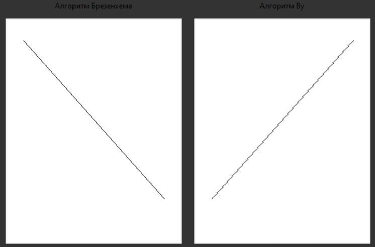

Задание 3. Выполнить градиентное окрашивание произвольного треугольника, у которого все три вершины разного цвета, используя алгоритм растеризации треугольника.

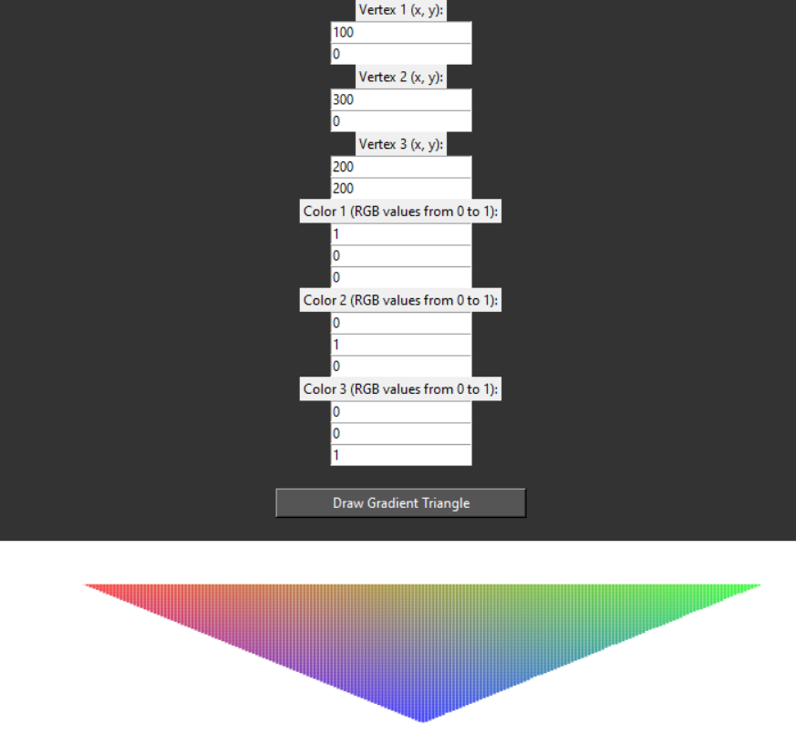

Задание 4. Аффинные преобразования на плоскости и вспомогательные алгоритмы
- Создание полигонов через клики мышью. Точка и ребро считаются полигонами с одной и двумя вершинами соответственно.
- Очистка сцены (удаление всех полигонов).
- Применение аффинных преобразований к полигону (Все преобразования должны быть реализованы матрицами!):
  - Смещение на dx, dy
  - Поворот вокруг заданной пользователем точки
  - Поворот вокруг своего центра
  - Масштабирование относительно заданной пользователем точки
  - Масштабирование относительно своего центра
- Поиск точки пересечения двух ребер (добавление второго ребра мышкой, динамически).
- Проверка принадлежит ли заданная пользователем (с помощью мыши) точка выпуклому и невыпуклому полигонам
- Классифицировать положение точки относительно ребра (справа или слева)

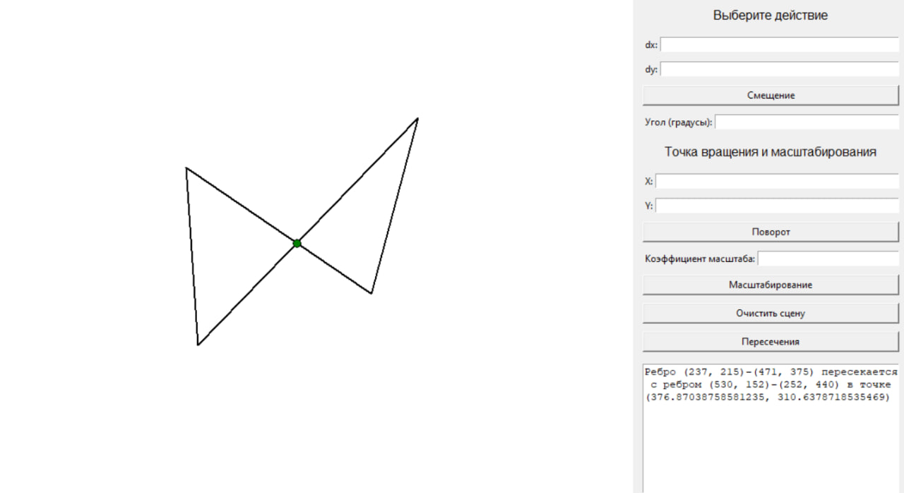

Задание 5. L-системы. Алгоритм midpoint displacement. Кривые Безье.
- 1a. Реализовать возможность разветвления в системе (скобки).
- 1b. Создать фрактальное дерево с изменением толщины от основания к ветвям, изменением цвета от коричневого к зеленому и случайным изменениям угла у ветвей

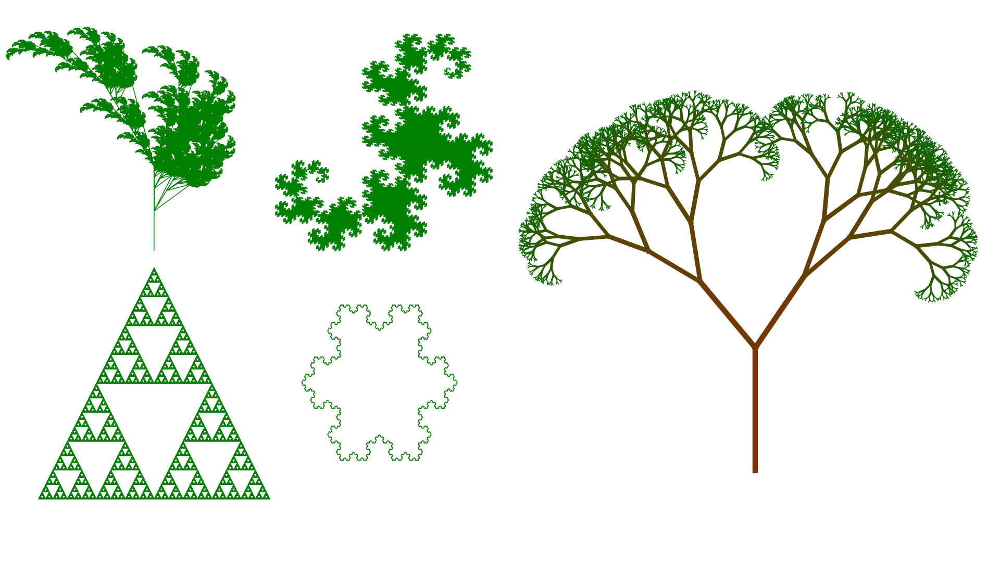